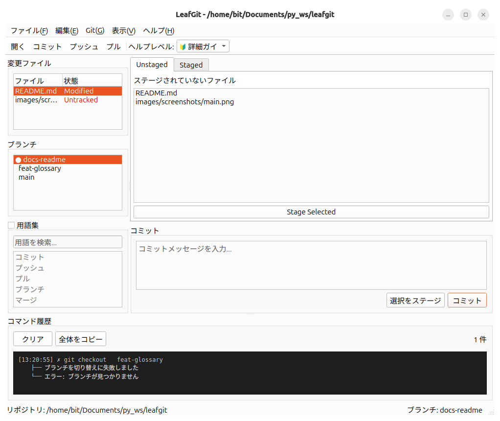
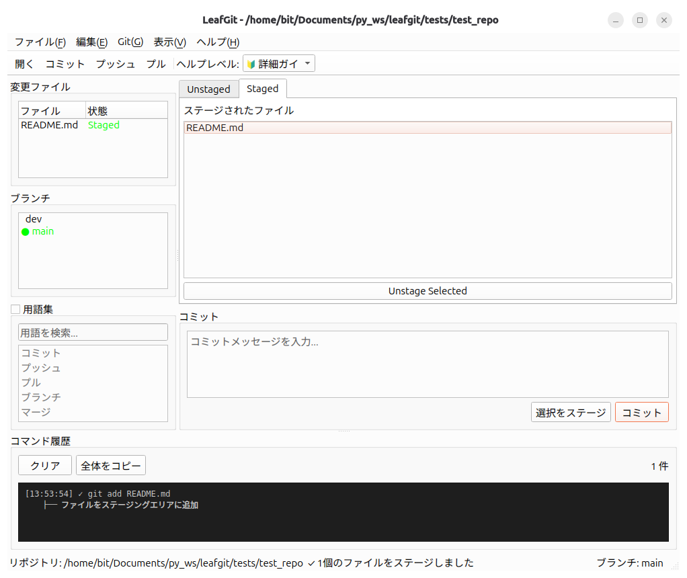
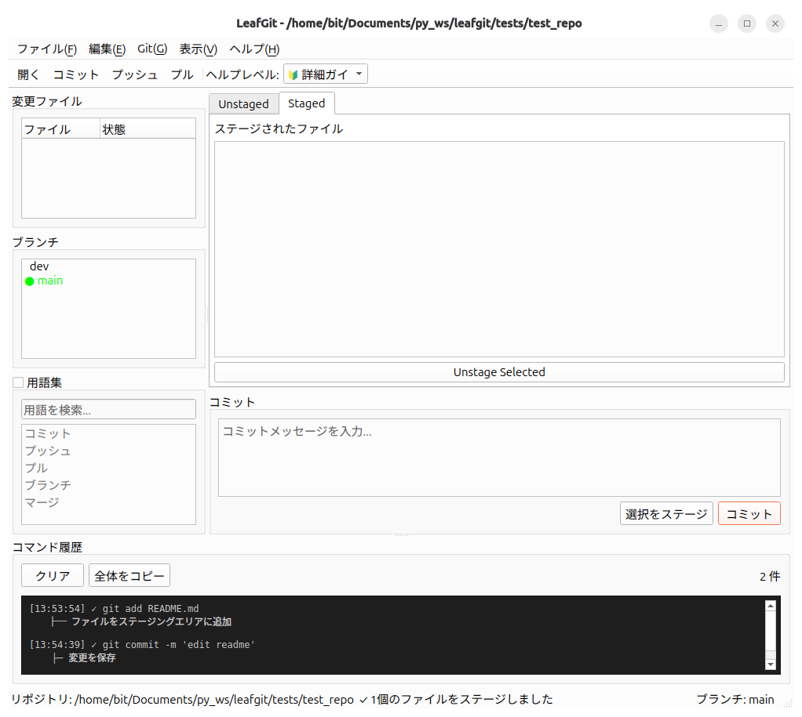

# LeafGit

Git/GitHub の操作を GUI で行うための学習支援アプリケーション



## 概要

**LeafGit** は、プログラミングの基礎知識はあるものの Git/GitHub や CLI 操作に不慣れな初学者を対象とした、Git・GitHub 操作の学習支援 GUI アプリケーションです。

従来のコマンドラインツールは習得の敷居が高く、初心者にとって挫折の要因となることがあります。LeafGit は GUI を通じて視覚的かつ直感的に Git の基本操作（リポジトリ作成、ステージング、コミット、ブランチ管理、push/pull など）を実行できます。

その上で、GUI で行った操作に対応する実際の Git コマンドをリアルタイムに表示することで、**「GUI での操作」と「CLI での操作」の橋渡し** を実現します。これにより、ユーザーは GUI から段階的に始めて、最終的には CLI へと自然に移行できます。エラーが発生した場合においても、メッセージをわかりやすい日本語に置き換えて表示し、エラーに対する恐怖を軽減しています。

さらに、組み込みの Git 用語集により、操作中に不明な専門用語を即座に確認でき、段階的ヘルプシステムでユーザーのスキルレベルに応じた支援を提供します。Python 3.12、PySide6、GitPython を用いて実装されており、クロスプラットフォーム対応の堅牢な設計となっています。

## 主な機能

### 基本の Git 操作

- リポジトリの作成・クローン
- ファイルのステージング・コミット
- ブランチ管理
- プッシュ・プル

### 学習支援機能

- 操作に対応する Git コマンドの表示
- コマンド履歴のリアルタイム表示
- Git 用語集
- 段階的ヘルプシステム

### GitHub 連携

- リモートリポジトリへの push/pull

## 必要要件

- Python 3.12 以上
- Git（システムにインストール済みであること）

## インストール

### 方法1: バイナリ版（推奨）

Python 環境が不要な実行ファイルを配布しています。

#### Linux

```bash
# バイナリのダウンロード（Releases ページから）
wget https://github.com/NekoChan9382/leafgit/releases/latest/download/leafgit-linux-x86_64

# 権限付与
chmod +x leafgit-linux-x86_64

# 実行
./leafgit-linux-x86_64
```

#### Windows

1. [Releases ページ](https://github.com/NekoChan9382/leafgit/releases)から `leafgit-windows-x86_64.exe` をダウンロード
2. ダウンロードしたファイルを実行

### 方法2: ソースコードから実行

Python 開発環境がある場合は、ソースコードから直接実行できます。

```bash
# リポジトリのクローン
git clone https://github.com/NekoChan9382/leafgit.git
cd leafgit

# 仮想環境の作成（推奨）
python3 -m venv .venv
source .venv/bin/activate  # Windows: .venv\Scripts\activate

# 依存関係のインストール
pip install -r requirements.txt

# アプリケーションの起動
python src/main.py
```

### 方法3: 開発者向けインストール

```bash
# 開発用の依存関係も含めてインストール
pip install -e .[dev]
```

## バイナリビルド（開発者向け）

実行ファイルを生成する場合は、PyInstaller を使用します。

```bash
# 依存関係のインストール（pyinstaller を含む）
pip install -r requirements.txt

# ビルドスクリプトの実行
# Linux/macOS
chmod +x build.sh
./build.sh

# Windows
build.bat
```

ビルド完了後、`dist/leafgit/` ディレクトリに実行ファイルが生成されます。

```bash
# 実行
./dist/leafgit/leafgit  # Linux/macOS
# または
dist\leafgit\leafgit.exe  # Windows
```

## 使い方

```bash
# ソースコードから実行する場合
python src/main.py

# バイナリ版の場合
./leafgit  # Linux/macOS
leafgit.exe  # Windows
```

## 開発

```bash
# テストの実行
pytest

# コードフォーマット
black src/

# リンターの実行
flake8 src/
```

## スクリーンショット



## ライセンス

MIT License

## 製作期間

2025/12 ~

## 作者

NekoChan9382 / bit
